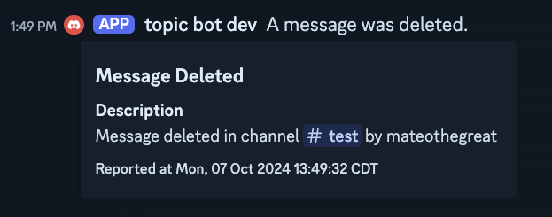

# discord delete detector

A simple bot that detects when a message is deleted and logs it a channel.



## Installation

```sh
go install github.com/mateothegreat/go-discord-delete-bot@latest
```

## Usage

### With a `.env` file

Create a file called `.env` and set the `DISCORD_TOKEN` environment variable.

```sh
DISCORD_TOKEN=<your token here>
```

Then run the bot:

```sh
go-discord-delete-bot
```

### Without a `.env` file

```sh
go-discord-delete-bot --token <your token here>
```
